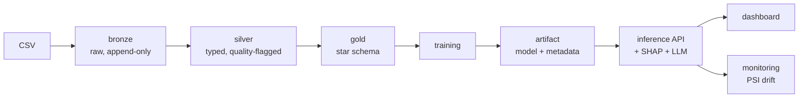

# Enterprise AI Platform

A domain-agnostic machine learning platform, currently configured for consumer
credit risk. It ingests raw data into a medallion architecture in PostgreSQL,
trains a model through a fixed and enforced protocol, serves predictions over
HTTP with SHAP explanations and an optional schema-validated language-model
narrative, and monitors incoming traffic for distribution drift.

The architecture claim — that this is a platform rather than a credit model —
is tested rather than asserted: a second pipeline for a different domain runs on
the same infrastructure with one new file, one registry line, and one
environment variable changed.

---

## Architecture



Full detail: [`docs/architecture/architecture.md`](docs/architecture/architecture.md)

---

## Quickstart

**Prerequisites**

- Docker Desktop (with WSL 2 integration if on Windows)
- `cs-training.csv` from the Give Me Some Credit dataset

The dataset is not included — it is large and its redistribution has licensing
implications, so it is gitignored.

```bash
git clone https://github.com/NilsGrahn/enterprise-ai-platform.git
cd enterprise-ai-platform

# 1. Place the dataset
mkdir -p data/raw
cp /path/to/cs-training.csv data/raw/

# 2. Configuration
cp .env.example .env
#    Optional: set LLM_API_KEY for narratives.
#    Without it the system degrades to a deterministic template.

# 3. Build the shared base image
docker build -f infrastructure/docker/Dockerfile.base -t eap-base:latest .

# 4. Bring up the platform
cd infrastructure
docker compose --env-file ../.env up --build
```

Compose runs the stages in dependency order: Postgres becomes healthy, the ETL
loads 150,000 rows through bronze and silver into the gold star schema, a model
trains and activates, the drift reference is built, then the API and dashboard
start. First run takes a few minutes.

| Service | URL |
|---|---|
| API docs | http://localhost:8000/docs |
| Health | http://localhost:8000/health |
| Dashboard | http://localhost:8501 |
| Postgres | `localhost:5433` |

`--env-file ../.env` is required because the compose file lives in
`infrastructure/` while `.env` is at the repo root.

**Scoring an applicant:**

```bash
curl -s -X POST http://localhost:8000/predict \
  -H 'Content-Type: application/json' \
  -d '{"include_explanation": true, "features":
       {"RevolvingUtilizationOfUnsecuredLines": 0.95, "age": 32, "DebtRatio": 0.9,
        "MonthlyIncome": 2500, "NumberOfOpenCreditLinesAndLoans": 12,
        "NumberRealEstateLoansOrLines": 0, "NumberOfTime30-59DaysPastDueNotWorse": 3,
        "NumberOfTime60-89DaysPastDueNotWorse": 1, "NumberOfTimes90DaysLate": 2,
        "NumberOfDependents": 3}}' | python -m json.tool
```

Field names accept the original dataset headers, so a raw source row can be
posted unchanged.

---

## Screenshots

### Analyst view


One applicant scored, with SHAP contributions ranked by absolute impact,
adverse-action reason codes, and model provenance.

### Portfolio view


Population default rates by delinquency severity and income band, from the star
schema.

### Drift detection firing


PSI per feature after deliberately shifted traffic. Shifting two raw inputs
moved five engineered features.

---

## Demonstrating drift

The detector can be shown firing rather than described:

```bash
cd infrastructure
alias dc='docker compose --env-file ../.env'

# Normal traffic — expect all OK
dc run --rm -e INFERENCE_API_URL=http://api:8000 \
  etl python -m monitoring.simulate_drift --n 500 --shift none
dc run --rm etl python -m monitoring.run_drift_check --window-hours 1

# Shifted traffic — expect ALERT
dc exec postgres psql -U platform_app -d ai_platform \
  -c "TRUNCATE monitoring.prediction_log;"
dc run --rm -e INFERENCE_API_URL=http://api:8000 \
  etl python -m monitoring.simulate_drift --n 500 --shift severe
dc run --rm etl python -m monitoring.run_drift_check --window-hours 1
```

---

## Adding a new domain

Three actions:

**1. Write the pipeline** — `ml-service/src/ml_service/pipelines/fraud_pipeline.py`:

```python
class FraudPipeline(BasePipeline):
    name = 'fraud'
    target_column = 'is_fraudulent'
    source_table = 'gold.v_fraud_events'

    @property
    def required_columns(self): ...
    def clean(self, df): ...
    def feature_engineering(self, df, fit): ...
    def train(self, X_train, y_train, X_valid, y_valid): ...
    def predict(self, df): ...
```

**2. Register it** — one import and one line in `pipelines/__init__.py`.

**3. Switch** — `ACTIVE_PIPELINE=fraud` in `.env`.

The training script, evaluation script, API, dashboard, monitoring, containers
and CI are unchanged. This is verified: see section 9 of the architecture
document, and `dummy_pipeline.py`, which exists as a permanent regression test.

---

## Tests

```bash
pip install -r requirements.txt && pip install -e .
pytest --cov
```

138 tests, ~88% coverage. No test requires a live database, a real LLM key, or a
trained artifact — fixtures generate synthetic data and train a small model
in-session.

CI runs lint, migrations against a real Postgres service container, and the full
suite on every push. Image builds are gated on tests passing.

---

## Architecture decisions

| ADR | Title |
|---|---|
| [0001](docs/architecture/ADR-0001-medallion-in-postgres.md) | Medallion architecture in PostgreSQL |
| [0003](docs/architecture/ADR-0003-etl-idempotency-and-dq.md) | ETL idempotency and data quality |
| [0004](docs/architecture/ADR-0004-pipeline-abstraction.md) | Pipeline abstraction, registry, artifact contract |
| [0005](docs/architecture/ADR-0005-llm-guardrails.md) | LLM guardrails |
| [0006](docs/architecture/ADR-0006-inference-api-contract.md) | Inference API contract |
| [0007](docs/architecture/ADR-0007-dashboard-as-api-consumer.md) | Dashboard as API consumer |
| [0008](docs/architecture/ADR-0008-drift-monitoring.md) | Prediction logging and PSI drift |
| [0009](docs/architecture/ADR-0009-containerisation.md) | Containerisation and compose |
| [0010](docs/architecture/ADR-0010-testing-and-ci.md) | Test strategy and CI/CD |
| [0011](docs/architecture/ADR-0011-platform-claim-verification.md) | Platform claim verification |

---

## Limitations

Summarised; full detail in section 8 of the architecture document.

- A single static snapshot, so no out-of-time validation
- No ground truth, so drift detection is input-only and cannot detect accuracy decay
- Single-node Postgres
- No authentication on the API
- The explainability layer assumes tree models
- Age is a model input and would need a fairness review
- **Decision support only** — a human officer makes the decision

---

## Stack

Python 3.11 · PostgreSQL 16 · pandas · XGBoost · SHAP · FastAPI · Streamlit ·
Plotly · pydantic · SQLAlchemy · Anthropic API · pytest · Docker · GitHub Actions