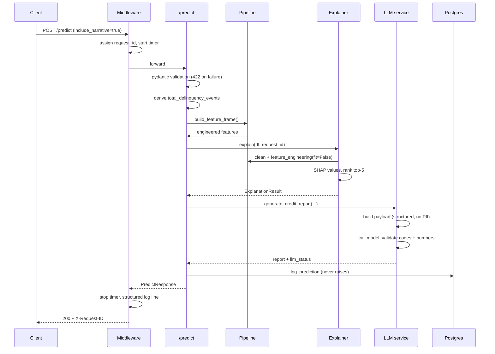

# Enterprise AI Platform — Architecture

A domain-agnostic machine learning platform, currently configured for consumer
credit risk assessment.

---

## 1. Problem statement

A lender needs to estimate the probability that an applicant will become
seriously delinquent — 90 or more days past due — within two years, and needs
that estimate to be explainable. Under ECOA and Regulation B a declined
applicant must receive specific principal reasons; "the model said so" is not
sufficient. The system must therefore produce not only a score but an
attribution of that score to specific factors, expressed in a controlled
vocabulary, with a human officer making the final decision.

The secondary requirement shapes the architecture more than the first: the
platform must not be a credit system. Credit is the first domain, not the only
one, so all infrastructure depends on an abstract pipeline interface and domain
knowledge is confined to a single folder. Section 9 reports the test of that
claim.

---

## 2. System context

```mermaid
graph LR
    CSV[data/raw/cs-training.csv]

    subgraph ingest[integration-service]
        SRC[CsvFileSource<br/>chunked, dtype=str]
    end

    subgraph db[(PostgreSQL — ai_platform)]
        BRONZE[bronze<br/>loan_applications<br/>ingestion_runs]
        SILVER[silver<br/>loan_applications<br/>data_quality_log]
        GOLD[gold<br/>6 dimensions<br/>2 fact tables<br/>v_credit_assessment]
        MON[monitoring<br/>prediction_log<br/>drift_report<br/>service_event]
    end

    subgraph ml[ml-service]
        TRAIN[train.py<br/>BasePipeline.run_training]
        ART[artifacts/&lcub;pipeline&rcub;/&lcub;version&rcub;/<br/>model.pkl<br/>metadata.json<br/>reference_profile.json]
    end

    subgraph serve[inference-api]
        API[FastAPI<br/>/predict /health /metrics]
        EXP[explain-service<br/>SHAP]
        LLM[llm-service<br/>guarded narrative]
    end

    DASH[dashboard<br/>Streamlit]
    DRIFT[monitoring<br/>run_drift_check]

    CSV --> SRC --> BRONZE --> SILVER --> GOLD
    GOLD --> TRAIN --> ART --> API
    TRAIN -->|dim_model| GOLD
    API --> EXP
    API --> LLM
    API -->|every prediction| MON
    MON --> DRIFT -->|drift_report| MON
    DASH -->|HTTP only| API
    DASH -->|read-only SQL| GOLD
    DASH --> MON
```

Two details differ from the original design and are load-bearing:

- **`gold.v_credit_assessment`** is a view joining `fact_credit_assessment` to
  `dim_borrower`, because `age` and `number_of_dependents` are borrower
  attributes rather than assessment measures. It keeps `load_data()` generic —
  a single `SELECT * FROM {source_table}` — rather than putting a join into the
  base class.
- **`reference_profile.json`** is produced by a separate step after training. It
  freezes the training distribution so drift has an unmoving baseline.

---

## 3. Components

| Service | Responsibility | Input | Output | Why separate |
|---|---|---|---|---|
| `integration-service` | Read a source, land it unmodified | CSV | bronze rows + audit row | A future domain's source may be a database or API; `DataSource` is the contract |
| `data-platform` | Connection layer, migrations, medallion transforms | bronze | silver, gold | Only file that knows how to reach Postgres; only place SQL lives |
| `ml-service` | Pipeline abstraction, training, registry | gold | artifact + `dim_model` row | Holds all domain logic, confined to `pipelines/` |
| `explain-service` | Per-prediction SHAP attribution | model + one row | ranked contributions | Deterministic and testable independently of the LLM |
| `llm-service` | Validated narrative from a structured payload | explanation | report + `llm_status` | Can be switched off; never touches reproducible values |
| `inference-api` | HTTP contract, validation, orchestration | JSON request | JSON response | The single integration point; loads the model once |
| `dashboard` | Two human views | API + gold | rendered UI | Pure API consumer, proving the API is the real interface |
| `monitoring` | Prediction logging, PSI drift | prediction log | drift report | Logging must never break serving |

---

## 4. Data model

### Medallion layers

**Bronze** — every column `TEXT`, append-only, never modified. Re-running
ingestion produces duplicates by design; deciding what is a duplicate requires
interpretation, and bronze makes no interpretive decisions. It is the replay
source if any downstream logic proves wrong.

**Silver** — typed, deduplicated on the most recent `bronze_id` per applicant,
and quality-flagged. Six rules, each setting a boolean rather than repairing the
value:

| Rule | Rows affected | Action |
|---|---|---|
| `income_missing` | 29,731 | flag only |
| `dependents_missing` | 3,924 | flag only |
| `age_invalid` | 1 | flag and null |
| `utilisation_outlier` | 3,321 | flag only |
| `delinquency_sentinel` | 269 | flag and null the offending column |
| `target_missing` | — | quarantine the row |

Imputation is deliberately absent. It is a modelling decision, and it must be
identical at train and serve time, so it lives in the pipeline where both share
one code path.

### Gold — star schema

Grain statements, stated in one sentence each because a grain that cannot be
stated in one sentence is wrong:

- **`fact_credit_assessment`** — one row per applicant per snapshot date.
  Enforced by `UNIQUE (applicant_id, snapshot_date_key)`.
- **`fact_prediction`** — one row per scoring request.

Dimensions: `dim_date`, `dim_borrower` (SCD Type 2), `dim_income_band`,
`dim_utilisation_band`, `dim_delinquency_profile` (junk dimension, all 16
combinations), `dim_model`.

`dim_borrower` uses Type 2 versioning so a decision made months ago can be
examined with the applicant's attributes *as they were then*. Comparison is on
*bands*, not raw values, so a birthday does not create a new version.

Row counts: bronze <N>, silver <N>, gold <N>.

### The star schema working

The query that demonstrates the dimensional model:

```
<paste your segment query output here>
```

Against a population default rate of 6.68%, `unreliable` and `severe`
delinquency profiles at low-to-mid income run five to ten times higher. This
requires every prior step to be correct: sentinel handling created
`unreliable`, banding created the income dimension, and the foreign keys held.

### The train/valid/test split

Assigned by hashing `applicant_id`, not randomly:

```
h = int(md5(str(applicant_id))[:8], 16) % 100
h < 70 -> train ; 70 <= h < 85 -> valid ; else test
```

A random split changes between runs, so rows migrate between train and test
across retrains, the model sees its own test data, and reported metrics inflate.
Hashing makes assignment permanent and machine-independent.

Measured: 104,790 / 22,856 / 22,354 rows, with default rates 0.0670 / 0.0659 /
0.0671 — near-identical, so no bias leaked between splits.

---

## 5. The pipeline abstraction

### The interface

`BasePipeline` declares four abstract methods — `clean`, `feature_engineering`,
`train`, `predict` — plus a `required_columns` property and three identity
attributes: `name`, `target_column`, `source_table`.

`run_training()` is **concrete and not overridable**. It fixes the order:

```
load train + valid
  → validate schema
  → clean
  → feature_engineering(train, fit=True)   [learn medians and caps]
  → feature_engineering(valid, fit=False)  [apply them, learn nothing]
  → train
  → save artifact
  → register in dim_model
```

The order is a correctness property, not a domain choice. If a subclass could
reorder it, someone would eventually fit preprocessing on validation data, or
skip schema validation, or forget to save the artifact. Fixing it in the base
class makes those errors structurally impossible.

### Train/serve consistency

Three mechanisms, all verified by tests:

1. **Learned values are persisted, never recomputed.** The training median
   income and the 99th-percentile caps are written into `metadata.json` and read
   back at serve time. A single live request has no population to compute a
   median from.
2. **The `fit` flag makes learning explicit.** `fit=False` cannot learn.
3. **Column order is frozen.** Tree models learn from column positions; a
   reordering produces silently wrong predictions rather than an error.

Verified by scoring 100 test rows through the HTTP API and through
`pipeline.predict` directly: **maximum absolute difference 0.0000000000**.

### Adding a domain

Three actions:

1. Write `pipelines/{domain}_pipeline.py` implementing the four methods
2. Add one import and one registry line
3. Set `ACTIVE_PIPELINE={domain}`

Nothing else changes. Section 9 reports the test of this.

---

## 6. Request lifecycle



Explanations are on by default (milliseconds). Narratives are off by default
(seconds, and an API cost).

---

## 7. Non-functional properties

| Property | Measured |
|---|---|
| p50 latency | `<N>` ms |
| p95 latency | `<N>` ms |
| Latency without explanation | ~`<N>` ms |
| Latency with narrative | ~`<N>` ms |
| Full ETL, 150k rows, cold database | ~`<N>` s |
| Training | ~`<N>` s |
| `eap-base` image | `<N>` MB |
| `eap-api` image | `<N>` MB |
| `eap-dashboard` image | `<N>` MB |
| Cold start to first prediction | ~`<N>` s |

Model performance (test split, from the model card):

| Metric | Value |
|---|---|
| AUC | `<N>` |
| KS | `<N>` |
| Precision @ 0.5 | `<N>` |
| Recall @ 0.5 | `<N>` |
| Decile 0 lift | `<N>`x |

Precision is low by design. `scale_pos_weight ≈ 13.9` pushes the model toward
catching defaulters, because a missed defaulter costs far more than a wrongly
flagged applicant. `DECISION_THRESHOLD` is configurable so a risk team can move
that balance without retraining.

---

## 8. Limitations

Stated plainly. Each is a real constraint, not a caveat.

**A single static snapshot, so no temporal validation.** The dataset is one
point in time. Train/valid/test are split by hash, not by date, so the model has
never been validated on genuinely future data. A real deployment would use
out-of-time validation. Reported metrics are optimistic relative to that.

**No ground truth, so drift is input-only.** PSI detects that incoming
distributions have moved from training. It cannot detect that the model has
become *inaccurate*, because that needs real outcomes, which for credit default
arrive one to two years later. `fact_prediction.actual_outcome` exists and will
always be `NULL` here. **This is the single most important limitation of the
monitoring layer.**

**Single-node Postgres.** Storage and compute are coupled, there is no
replication, and this design stops working at hundreds of millions of rows. The
medallion layers are schemas in one database, which was the right call at 150k
rows and would not be at 150M.

**No authentication.** `/predict` is open on a published port. Fine for a local
portfolio deployment; unacceptable for anything real. There is also no rate
limiting and no audit of *who* requested a score.

**Explainability infrastructure assumes tree models.** `ShapTreeExplainer` does
not support linear models, and `DISPLAY_NAMES` and `REASON_CODES` are keyed by
credit feature names. Section 9 reports how this surfaced.

**Age is a model input.** Age is a protected characteristic under ECOA. It is
mapped to a reason code phrased as length of credit-relevant history, and the
LLM is forbidden from referencing protected characteristics — but the feature is
still in the model, and it appeared as a risk-increasing contributor in live
output. A production deployment would need a fairness review and would likely
remove it.

**No fairness testing.** No disparate-impact analysis across proxy segments has
been performed.

**The model is decision support.** It produces a modelled probability and the
statistical associations behind it. SHAP measures association within a model,
not causation. A human officer decides.

**Unpinned dependencies and pickle serialisation.** `requirements.txt` has no
version pins, so images built months apart may differ. `model.pkl` is not
portable across very different library versions; `hyperparameters` is recorded
so a model can be retrained identically if a load fails.

**Bronze and `prediction_log` grow without bound.** No retention policy.
Partitioning or archiving would be required in production.

---

## 9. The platform claim, tested

### Method

A second pipeline, `DummyPipeline`, deliberately different from `CreditPipeline`
in every way the abstraction is supposed to tolerate:

| | `CreditPipeline` | `DummyPipeline` |
|---|---|---|
| Source table | `gold.v_credit_assessment` | `gold.fact_credit_assessment` |
| Features | 17 | 2 |
| Algorithm | XGBoost | Decision tree |
| Learned preprocessing | median, two caps | none |
| Derived features | 5 | 0 |

Registered with one import and one dictionary line. `ACTIVE_PIPELINE` changed to
`dummy`. Trained, activated, and served.

### Result

Working with **no modification**:

- `train.py`, `evaluate.py`, `registry.py`, `artifacts.py`, `base_pipeline.py`
- All of `inference-api/` — `/predict` returned `pipeline_name: "dummy"` with a
  two-factor SHAP explanation carrying reason codes
- All of `dashboard/` — both views functional
- All of `monitoring/` — predictions logged with the dummy feature vector; drift
  check profiled 2 features
- All of `infrastructure/` and `.github/`
- All of `tests/` — the contract suite is parametrised over `PIPELINE_REGISTRY`,
  so it extended to the new pipeline automatically with no test edited

Total change: **one new file, one registry line, one environment variable.**

```
<paste your dummy /predict response here>
```

### What it exposed

The test also surfaced two assumptions, both in the explainability layer:

**`ShapTreeExplainer` assumes a tree model.** `shap.TreeExplainer` does not
support linear models. The original design for this test specified
`LogisticRegression`, which would fail at explainer construction and leave the
API reporting `model_loaded: false`. A decision tree was used instead — which
makes the test pass but avoids the assumption rather than fixing it.

**`DISPLAY_NAMES` and `REASON_CODES` are keyed by credit feature names**, and
both raise on a missing entry rather than falling back. The dummy pipeline
reuses two existing names, sidestepping this the same way. A pipeline with novel
feature names would fail.

Both are documented in ADR-0011 with proposed fixes: a `BaseExplainer` factory
selecting an explainer by model type, and moving both mappings onto
`BasePipeline` as properties.

### Assessment

The abstraction held across the training layer, the serving layer, the
dashboard, monitoring, containerisation and CI. It did not hold cleanly in the
explainability layer, where two credit-specific assumptions live in
infrastructure.

"It held everywhere except here, and here is exactly why" is the honest result,
and a more useful one than an unqualified pass.

---

## 10. What I would do next

**Fix the explainability leaks** — an explainer factory by model type, and
per-pipeline display names and reason codes.

**Out-of-time validation** — split by date rather than hash, and report
performance on a genuinely later period.

**A feedback loop** — backfill `fact_prediction.actual_outcome` as outcomes
arrive, enabling real performance monitoring rather than input drift alone.

**Champion/challenger** — the `dim_model` schema already supports multiple
registered versions per pipeline; routing a fraction of traffic to a challenger
would need only a routing rule.

**Authentication and rate limiting** — API keys or OAuth, per-caller audit.

**Fairness testing** — disparate impact across proxy segments, with age
reconsidered as a feature.

**A feature store** — the derived features are computed in two places
(`load_fact_assessment.py` and `to_pipeline_frame`), which is the duplication a
feature store exists to remove.

**Pinned dependencies** — a lock file, so an image built today and one built in
a year are identical.